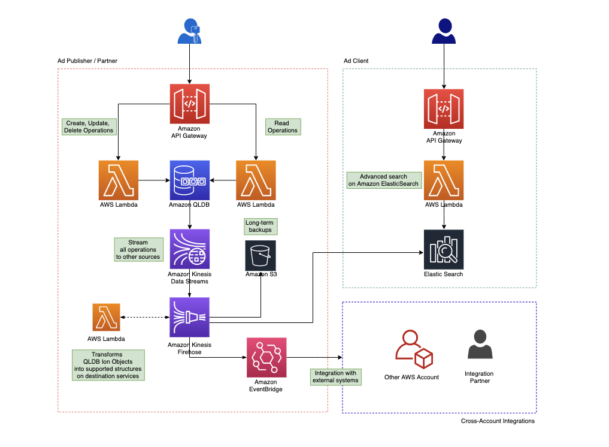
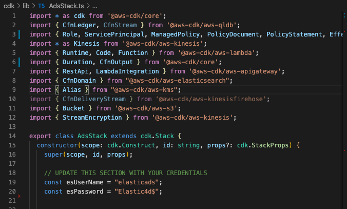

# Event Sourcing and System of Record using Amazon QLDB
This is an example implementation of a System of Record for a **Classified Ads** platform. This example follows an **Event Sourcing and CQRS** (Command Query Responsibility Segregation) pattern using [Amazon QLDB](https://aws.amazon.com/qldb/) as an immutable append-only event store and source of truth. 

> For this specific use case we have focused on the backend services only. 

## Why Event Sourcing and CQRS?
**Event Sourcing** is a pattern that tipically introduces the concept of **Event Store** - where all events are tracked - and **State Store** - where the latest and final state of each object is stored. While this may add some complexity to the architecture it has some advantages such as:
 - **Auditing**: Events are immutable and each state change corresponds to one or more events stored on the event store.
 - **Replay events**: in case of application failure, we are able to reconstruct the state of an entity by replaying all the events since the event store maintains the complete history of every single entity. 
 - **Temporal queries**: we can determine the application state at any point in time very easily. This can be achieved by starting with a blank state store and replaying the events up to a specific point in time.
 - **Extensibility**: The event store raises events, and tasks perform operations in response to those events. This decoupling of the tasks from events allows more flexibility and extensibility.

In traditional data management systems, both commands and queries are executed against the same data store. This introduces some challenges for applications with a large customer base, such as increased risk for data contention, additional complexity managing security and running routine operations. **CQRS** (Command Query Responsibility Segregation) pattern aims to solve this issues by segregating read and write operations which as some obvious benefits:
 - **Indepedent scaling**: CQRS allows the read and write workloads to scale independently which may result in fewer lock contentions and optimized costs. 
 - **Optimized data schemas**: The read side can use a schema optimized for queries, while the write side uses a schema optimized for updates.
 - **Security**: It's easier to ensure that only the right entity as access to perform reads or writes on the correct data store.
 - **Separation of concerns**: Models will be more maintainable and flexible. Most of the complex business logic goes into the write model.
 - **Simpler queries**: By storing a materialized view in the read database the application can avoid complex joins that are compute intensive and potentially more expensive.


## Architecture
The below architecture represents all the components used in setting up this example. **Amazon QLDB** was the obvious choice for this scenario since it is an immutable data store that triggers events which allows the platform to be highly extensible and support virtually any type of integration (*ex: ElasticSearch for Client APIs or EventBridge for integration across AWS Accounts*).



## Requirements
- Visual Studio Code ([install](https://code.visualstudio.com/download))
- AWS Toolkit for Visual Studio Code ([install](https://docs.aws.amazon.com/toolkit-for-vscode/latest/userguide/setup-toolkit.html))
- Node.js ([install](https://nodejs.org/en/download/))
- Serverless Framework ([install](https://www.serverless.com/framework/docs/providers/aws/guide/installation/))
  

## How to deploy
Every single component of this infrastructure is automatically deploy by using [AWS CDK](https://aws.amazon.com/cdk/). To deploy follow this steps:

1. **Clone the project**

    ```bash
    $ mkdir projects && cd projects
    $ git clone https://github.com/t1agob/eventsourcing-qldb.git eventsourcing-qldb
    ```

2. **Open the project in Visual Studio Code**
   
    ```bash
    $ cd eventsourcing-qldb
    $ code .
    ```

3. **Navigate to cdk folder and install dependencies**
   
    ```bash
    $ cd cdk
    $ npm install
    ```

4. **Update master username and password for ElasticSearch**

    On lines 19 and 20 you may find the master username and password that are going to be used as the credentials to access ElasticSearch service. You may want to use your own credentials so you should update the values here.

    > ElasticSearch enforces that the password contains one uppercase letter, one lowercase letter, one number and a special character. 


    

5. **Install project dependencies and package projects**
   
   In order for CDK to be able to deploy, not only the infrastructure required but also the Lambda Functions that do the actual work, we need to make sure they are packaged correctly.

   Run the following scirpt from the current location to make sure all dependencies are installed and the projects are packaged.

   ```bash
    $ ./package-projects.sh
   ```

6. **Deploy with CDK**

    ```bash
    $ cdk deploy
    ```

    The full deployment takes around 15min to complete since this is a complex infrastructure but once deployed everything should be working right away.


## How to use
Since we just created the APIs for the services we don't have a UI that allows us to test the scenario so it needs to be done by calling the APIs directly. For that you can use cURL, Postman or any other tool you prefer - I will use cURL for simplicity.

> **Make sure to replace placeholders in the Url.**

#### Create Ad

```json
curl --location --request POST '[API ENDPOINT]/publisher/[PUBLISHER ID]/ad' \
--header 'Content-Type: application/json' \
--data-raw '{
  "adTitle": "awesome title",
  "adDescription": "awesome description",
  "price": 10,
  "currency": "€",
  "category": "awesome category",
  "tags": [
      "awesome",
      "category"
  ]
}'
```

#### Update Ad

```json
curl --location --request PATCH '[API ENDPOINT]/publisher/[PUBLISHER ID]/ad/[AD ID]' \
--header 'Content-Type: application/json' \
--data-raw '{
  "adTitle": "awesome title",
  "adDescription": "awesome description",
  "price": 150,
  "currency": "€",
  "category": "awesome category",
  "tags": [
      "awesome",
      "category"
  ]
}'
```

#### Delete Ad

```json 
curl --location --request DELETE '[API_ENDPOINT]/publisher/[PUBLISHER_ID]/ad/[AD_ID]'
```

#### Get All Ads for specific Publisher

```json
curl --location --request GET '[API_ENDPOINT]/publisher/[PUBLISHER_ID]/ad'
```

#### Get specific Ad

```json
curl --location --request GET '[API_ENDPOINT]/publisher/[PUBLISHER_ID]/ad/[AD_ID]'
```

#### Get specific Ad with versions

```json
curl --location --request GET '[API_ENDPOINT]/publisher/[PUBLISHER_ID]/ad/[AD_ID]?versions=true'
```

#### Search Ads on ElasticSearch

```json
curl --location --request GET '[API_ENDPOINT]/?q=[QUERY]'
```

# Work in progress

- [x] Add DynamoDB as the state store
- [x] Update internal GET operations to query DynamoDB instead of QLDB (for best practices and scalability purposes)
- [ ] Implement Event Sourcing features 
  - [x] Snapshot
    - [x] Create a **snapshot** of state store after specific timeframe (eg. every 1st day of each month)
  - [ ] Replay
      - [ ] Allow **replay of a single entity** back to a specific point in time
      - [ ] Allow **full replay of a single entity** - specific entity lost in state store
      - [ ] Allow **replay of all items** - full state store loss
- [ ] Integration with EventBridge


# Important references
In order to process the items being streamed from QLDB we need to deaggregate these into separate Ion Objects and convert them into the right format so we can push them to Elastic Search and DynamoDB. For that we used the [Kinesis Record Aggregation & Deaggregation Modules for AWS Lambda](https://github.com/awslabs/kinesis-aggregation) open source project from [AWSLabs](https://github.com/awslabs) and took as a reference implementation the one created by [Matt Lewis](https://github.com/mlewis7127) in [QLDB Simple Demo](https://github.com/AWS-South-Wales-User-Group/qldb-simple-demo).


## Contributions are welcome!

If you feel that there is space for improvement in this project or if you find a bug please raise an issue or submit a PR.
